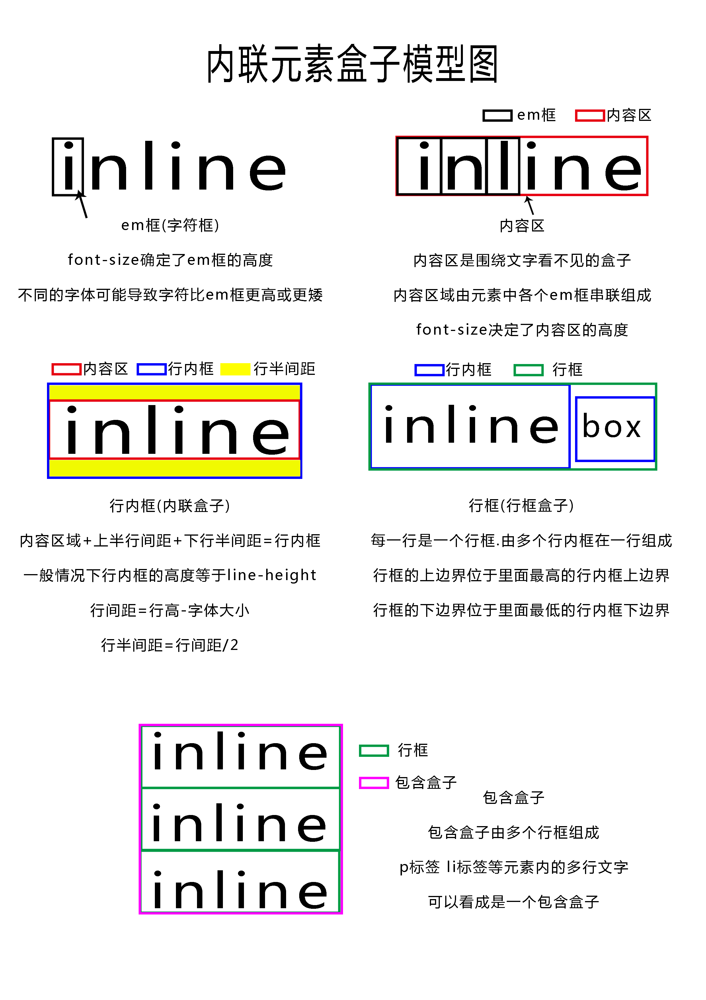

* content
{:toc}
## 1. 了解行内元素的盒子

1.1. 匿名文本:不在内联元素标签内的光秃秃的文字就是匿名文本  
```html
 <div>hello<span>wrold</span></div>
 <!--hello就是匿名文本  wrold就不是匿名文本-->
```


1.2. em框(字符框):em框由字体定义.就是单个字符外包裹的看不见的框.不同的字体可能超出框的边界,也可能更矮一些.em框的高度由font-size决定  
1.3. 内容区:内容区由多个em框串起来组成.在一行显示.  
1.4. 行间距:行间距=行高-内容区域高度  
1.5. 行内框(内联盒子):行内框高度等于行高.  
1.6. 行框盒子:每一行就是一个行框盒子,由多个行内框组成.行框的上边界等于里面最高的行内框上边界.行框的下边界等于里面最低的行内框下边界.  
1.7. 包含盒子:标签中有多行文字.多个行框就组成了一个包含盒子.  


## 2. 精讲line-height

line-heigt的含义:  

文字基线距离下一行文字基线的距离成为行高.  

内联元素的高度由行高决定   
1.行高由于其继承性,影响无处不在.即使单行文本也不例外  
2.了解行内元素的盒子模型.  

行高=内容区域高度+行间距  

line-height数值计算  

1.使用数值作为行高值如何计算  
例如:line-height:1.5  
假设字体大小为20px  
`line-height=1.5 * 20px =30px`

2.使用数值加单位作为行高值  
例如 `30px 10rem 5em 10pt`

3.使用百分比作为行高值  
例如:line-height:150%  
假设文字大小为20px  
`line-height=150% * 20 = 30px`

为什么要使用数值作为行高值?
```html
    .box1{font-size: 14px;line-height: 1.5; width: 300px;}
    .box2{font-size: 14px;line-height: 30px; width: 300px;}
    .son{font-size: 50px;}
   <div class="box1">
       1.5的行高
       <p class="son">
         这里的font-size为50px  
       </p>
   </div>
   <div class="box2">
       30px的行高
       <p class="son">
          这里的font-size为50px   
       </p>
   </div>
```
数值作为行高被继承后会根据当前元素的字体大小重新计算行高.但是数值加单位的方式等于把父元素的行高原封不动的继承了过来.(百分比设置行高也一样)  

思考一个问题:为什么行高设置成元素的高度就可以让文字垂直居中?  
要结合line-height的知识和行内元素盒子模型去理解  

用line-height:0 消除图片底部间隙
```html
*{margin: 0;padding: 0;}
    .box{width: 600px;background-color: aqua;line-height: 0}
   <div class="box">
       
       <span>你好</span>
   </div>
```
原理解释:  
行高不会影响图片实际占据的高度.  
图片默认与文字基线对齐.当内联框的行高为0时,也就没有行间距,缝隙就不存在.

## 3. 精讲 vertical-align

定义:行内元素的垂直对齐方式  
vertical-align只能在行内元素中起作用 

vertical-align属性支持数值单位的值和百分比值.  
行内元素默认在父元素的基线上.如果vertical-align值越大,元素在基线上面离基线越远.如果vertical-align值越小,元素在基线下面离基线越远.  

vertical-align其他几种值详解  
1.vertical-align:bottom; 元素的底部和内联元素整行的底部对齐.  
2.vertical-align:top; 元素的顶端和内联元素郑航的顶端对齐.  
3.vertical-align:middle; 元素的中心点和父级基线上1/2 x-height对齐  
4.vertical-align:text-top  
盒子的顶部和父级"内容区"的顶部对齐  
5.vertical-align:text-bottom  
盒子底部和父级"内容区"的底部对齐  

6.vertical-align:super  
提高盒子的基线到父级合适的上标基线位置  
7.vertical-align:sub  
降低盒子的基线到父级合适的下标基线位置  
8.将图片文字和图片对齐方式: align="absmiddle"  
9.图片居中方法
object-fit 只能用于『可替换元素』(replaced element) 。所谓可替换元素，是指元素的内容和表现不是由CSS控制的，独立渲染的外部元素，比如： img、 object、 video 和 表单元素，如textarea、 input，audio和 canvas在一些特殊情况下，也可以作为可替换元素。

在使用 object-fit 时，一定要设定元素的size，也就是 width 和 height

直入正题，object-fit 有五个可选值，分别是：

fill 默认值。填充，可替换元素填满整个内容区域，可能会改变长宽比。  
contain 包含，保持长宽比，保证可替换元素完整显示，长宽比和内容区域的长宽比不一致时，内容区域会出现空白。  
cover 覆盖，保持长宽比，保证内容区域被填满，所以可替换元素可能会被切掉一部分，从而不能完整展示。  
none 顾名思义，就是什么都没有啦，当然不是什么都没有啦，而且千万不要以为和fill是一样的！实际效果是，保持可替换元素原尺寸和比例。  
scale-down 等比缩小。效果类似 contain 或 none  
用法也超级简单：
```css
.cover{    object-fit: cover;
}.contain{    object-fit: contain;
}.fill{    object-fit: fill;
}.scale-down{    object-fit: scale-down;
}
```

object-position  
当元素被 object-fit 裁切的时候，你一定想知道如何控制裁切的位置。 嗯，顾名思义， object-position 就是为了解决这个问题的。

不过，object-position 不难理解，类似 background-position，不多说了。

浏览器兼容性
IE 全家不支持，包括最新的 EDGE  
android 4.4.4+ 支持，Chrome 29+ 支持  
Safari 7.1+ 和 iOS 8+ 支持 object-fit，不支持object-position  