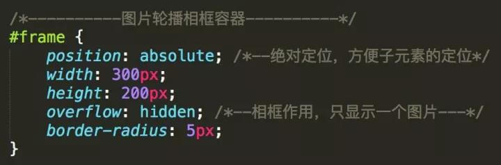
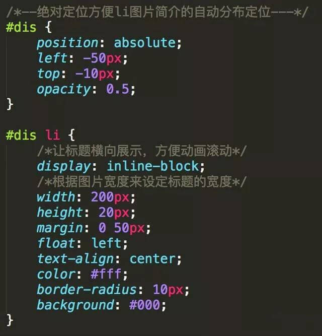
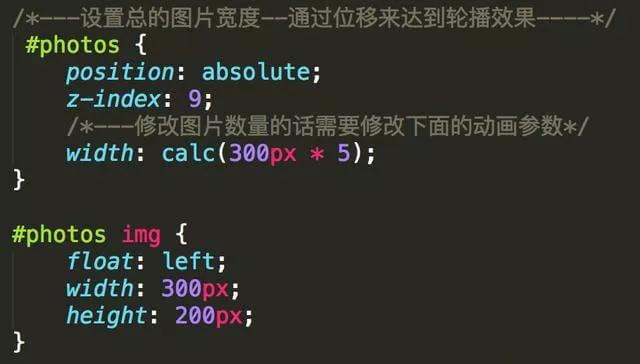
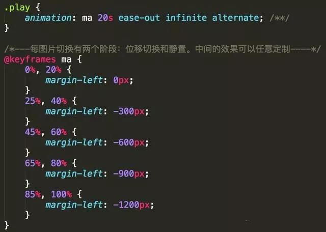
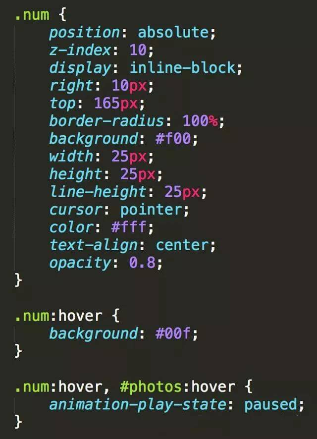
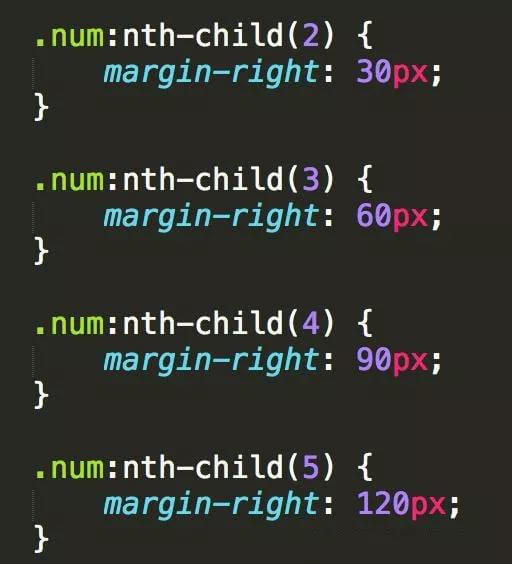
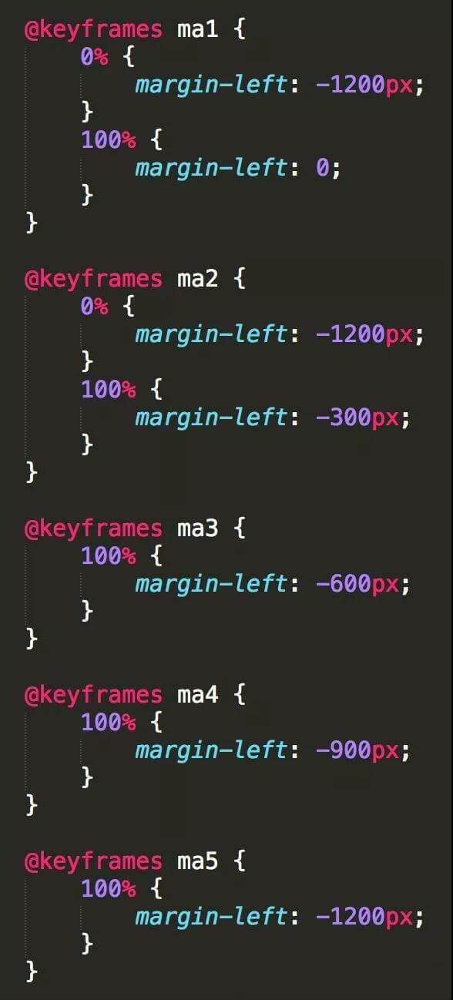
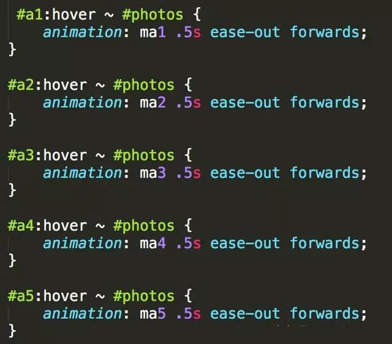

* content
{:toc}

## 具体分析
页面在布局上首先要有5张图片，图片固定宽度。
每张图片对应一个标题，标题通过ul>li实现，事先算好宽度，跟随图片一起滚动。
下边有个1,2,3,4,5表示图片顺序的索引，鼠标放上去后会显示对应的图片。

### HTML页面
接下来我们通过代码层面去看看整个效果是如何实现的。
首先来看看HTML页面的实现，代码中都有每个区域的描述。  
  
### CSS部分
实现这个效果主要是通过CSS代码的，其代码量比较大，我们分开来看。
### 外层容器
对于最外层容器我们设置绝对定位，方便图片标题子元素的定位。
外层容器
  
### 图片标题
对于图片的标题我们也采用绝对定位，并且让标题横向一行展示，方便在动画的时候直接横向滚动。
得到的代码如下所示。  
  
## 图片与图片容器
接下来是设置图片容器属性以及图片的基本大小。
图片容器也采用绝对定位，宽度可以动态设置，根据图片数量计算。每张图片设置宽度与高度，得到的代码如下。  
  
### 图片动画效果
然后设置图片的动画效果，对于任意的图片都有进入和静止两个状态，中间的效果可以任意定制。
在这里，中间效果设置成5%的间隔，其他时间在进行位置的切换，因为图片是处于水平分布，通过设置margin-left的值为负数进行偏移即可。  
  
### 数字索引的基本属性
对于下面的数字图标也是通过基本的CSS属性进行设置的，包括宽高，行高，透明度等等。
在鼠标移动到对应的数字上后，数字会显示不同的颜色。而且在鼠标停留在数字上后，动画效果会暂停。
  

### 数字索引的偏移量
因为数字是水平方向展示的，因此要设定每个数字的水平偏移量。

  
### 鼠标停在数字上的动画效果
然后就是处理鼠标停留在数字上的动画效果，因为每张图片对应特定的数字，需要计算出每次的动画开始位置和结束位置。

  
### 动画效果赋予指定的数字
最后一步就是将定义的动画效果赋予指定的数字上，每个数字都有特定的id。得到的代码如下。

  
至此所有步骤完成了，就可以得到文章开始的动画效果了。

[漂亮loading加载动画](https://mp.weixin.qq.com/s/3MTa1Gn6Jmo5XO1bUHkZDg)  
[你所不知道的 CSS 滤镜技巧与细节](https://mp.weixin.qq.com/s/noi4bSX-1mjtXwEHp6YXNQ)  
[10个不错的网页文字动画及源码](http://tobiasahlin.com/moving-letters/)