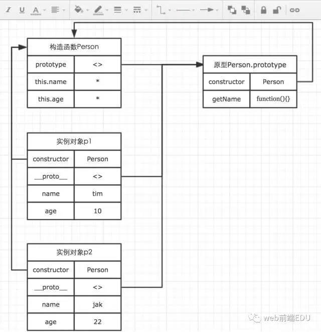
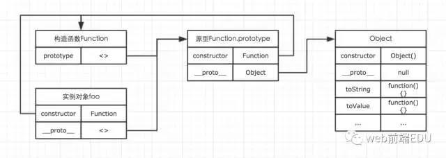
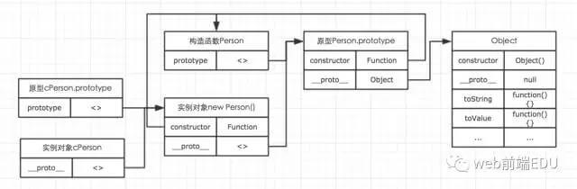

* content
{:toc}

## 一、对象的定义

在ECMAScript-262中，对象被定义为“无序属性的集合，其属性可以包含基本值，对象或者函数”。

也就是说，在JavaScript中，对象无非就是由一些列无序的key-value对组成。其中value可以是基本值，对象或者函数。


```js
// 这里的person就是一个对象var person = {
    name: 'Tom',
    age: 18,
    getName: function() {},    parent: {}
}
```
### 创建对象

我们可以通过new的方式创建一个对象。

var obj = new Object();
也可以通过对象字面量的形式创建一个简单的对象。

var obj = {};
当我们想要给我们创建的简单对象添加方法时，可以这样表示。
```js
// 可以这样var person = {};
person.name = "TOM";
person.getName = function() {    return this.name;
}// 也可以这样var person = {
    name: "TOM",
    getName: function() {        return this.name;
    }
}
```
### 访问对象的属性和方法

假如我们有一个简单的对象如下：
```js
var person = {
    name: 'TOM',
    age: '20',
    getName: function() {        return this.name
    }
}
```
当我们想要访问他的name属性时，可以用如下两种方式访问。

person.name// 或者person['name']
如果我们想要访问的属性名是一个变量时，常常会使用第二种方式。例如我们要同时访问person的name与age，可以这样写：
```js
['name', 'age'].forEach(function(item) {
    console.log(person[item]);})
```
这种方式一定要重视，记住它以后在我们处理复杂数据的时候会有很大的帮助。

## 二、工厂模式

使用上面的方式创建对象很简单，但是在很多时候并不能满足我们的需求。就以person对象为例。假如我们在实际开发中，不仅仅需要一个名字叫做TOM的person对象，同时还需要另外一个名为Jake的person对象，虽然他们有很多相似之处，但是我们不得不重复写两次。
```js
var perTom = {
    name: 'TOM',
    age: 20,
    getName: function() {
      return this.name
    }
};
var perJake = {
    name: 'Jake',
    age: 22,
    getName: function() {
      return this.name
    }
}
```
很显然这并不是合理的方式，当相似对象太多时，大家都会崩溃掉。

我们可以使用工厂模式的方式解决这个问题。顾名思义，工厂模式就是我们提供一个模子，然后通过这个模子复制出我们需要的对象。我们需要多少个，就复制多少个。
```js
var createPerson = function(name, age) {    // 声明一个中间对象，该对象就是工厂模式的模子
    var o = new Object();    // 依次添加我们需要的属性与方法
    o.name = name;
    o.age = age;
    o.getName = function() {
      return this.name;
    }
    return o;
}// 创建两个实例var perTom = createPerson('TOM', 20);var PerJake = createPerson('Jake', 22);
```
相信上面的代码并不难理解，也不用把工厂模式看得太过高大上。很显然，工厂模式帮助我们解决了重复代码上的麻烦，让我们可以写很少的代码，就能够创建很多个person对象。但是这里还有两个麻烦，需要我们注意。

第一个麻烦就是这样处理，我们没有办法识别对象实例的类型。使用instanceof可以识别对象的类型，如下例子：
```js
var obj = {};
var foo = function() {}
console.log(obj instanceof Object);  // trueconsole.log(foo instanceof Function); // true
```
因此在工厂模式的基础上，我们需要使用构造函数的方式来解决这个麻烦。

## 三、构造函数

在JavaScript中，new关键字可以让一个函数变得与众不同。通过下面的例子，我们来一探new关键字的神奇之处。
```js
function demo() {    
  console.log(this);
}

demo();  // windownew demo();  // demo
```
很显然，使用new之后，函数内部发生了一些变化，让this指向改变。那么new关键字到底做了什么事情呢。用代码实现一下:
```js
// 创建一个构造函数，其实该函数与普通函数并无区别
var Person = function(name, age) {    
  this.name = name;    
  this.age = age;    
  this.getName = function() {        
    return this.name;
    }
}
// 将构造函数以参数形式传入
function New(func) {    // 声明一个中间对象，该对象为最终返回的实例
    var res = {};    
    if (func.prototype !== null) {        // 将实例的原型指向构造函数的原型
        res.__proto__ = func.prototype;
    }    // ret为构造函数执行的结果，这里通过apply，将构造函数内部的this指向修改为指向res，即为实例对象
    var ret = func.apply(res, Array.prototype.slice.call(arguments, 1));    // 当我们在构造函数中明确指定了返回对象时，那么new的执行结果就是该返回对象
    if ((typeof ret === "object" || typeof ret === "function") && ret !== null) {        return ret;
    }    // 如果没有明确指定返回对象，则默认返回res，这个res就是实例对象
    return res;
}// 通过new声明创建实例，这里的p1，实际接收的正是new中返回的res
var p1 = New(Person, 'tom', 20);
console.log(p1.getName());// 当然，这里也可以判断出实例的类型了
console.log(p1 instanceof Person); // true
```
JavaScript内部再通过其他的一些特殊处理，将var p1 = New(Person, 'tom', 20);等效于var p1 = new Person('tom', 20);。就是我们认识的new关键字了。

为了能够判断实例与对象的关系，我们就使用构造函数来搞定。
```js
var Person = function(name, age) {    
  this.name = name;   
   this.age = age;    
   this.getName = function() {        
    return this.name;
    }
}
var p1 = new Person('Ness', 20);
console.log(p1.getName());  // Ness
console.log(p1 instanceof Person); // true
```

与普通函数相比，构造函数并没有任何特别的地方，首字母大写只是我们约定的小规定，用于区分普通函数；  
new关键字让构造函数具有了与普通函数不同的许多特点，而new的过程中，执行了如下过程：  
声明一个中间对象；  
将该中间对象的原型指向构造函数的原型；  
将构造函数的this，指向该中间对象；  
返回该中间对象，即返回实例对象。  
## 四、原型

虽然构造函数解决了判断实例类型的问题，但是，说到底，还是一个对象的复制过程。跟工厂模式颇有相似之处。也就是说，当我们声明了100个person对象，那么就有100个getName方法被重新生成。

这里的每一个getName方法实现的功能其实是一模一样的，但是由于分别属于不同的实例，就不得不一直不停的为getName分配空间。这就是工厂模式存在的第二个麻烦。

显然这是不合理的。我们期望的是，既然都是实现同一个功能，那么能不能就让每一个实例对象都访问同一个方法？

当然能，这就是原型对象要帮我们解决的问题了。

我们创建的每一个函数，都可以有一个prototype属性，该属性指向一个对象。这个对象，就是我们这里说的原型。

当我们在创建对象时，可以根据自己的需求，选择性的将一些属性和方法通过prototype属性，挂载在原型对象上。而每一个new出来的实例，都有一个__proto__属性，该属性指向构造函数的原型对象，通过这个属性，让实例对象也能够访问原型对象上的方法。因此，当所有的实例都能够通过__proto__访问到原型对象时，原型对象的方法与属性就变成了共有方法与属性。

我们通过一个简单的例子与图示，来了解构造函数，实例与原型三者之间的关系。

由于每个函数都可以是构造函数，每个对象都可以是原型对象，因此如果在理解原型之初就想的太多太复杂的话，反而会阻碍你的理解，这里我们要学会先简化它们。就单纯的剖析这三者的关系。
```js
// 声明构造函数
function Person(name, age) {    
  this.name = name;    
  this.age = age;
}// 通过prototye属性，将方法挂载到原型对象上
Person.prototype.getName = function() {    
  return this.name;
}
var p1 = new Person('tim', 10);
var p2 = new Person('jak', 22);
console.log(p1.getName === p2.getName); // true
```



通过图示我们可以看出，构造函数的prototype与所有实例对象的__proto__都指向原型对象。而原型对象与实例对象的constructor都指向构造函数。

除此之外，还可以从图中看出，实例对象实际上对前面我们所说的中间对象的复制，而中间对象中的属性与方法都在构造函数中添加。于是根据构造函数与原型的特性，我们就可以将在构造函数中，通过this声明的属性与方法称为私有变量与方法，它们被当前被某一个实例对象所独有。而通过原型声明的属性与方法，我们可以称之为共有属性与方法，它们可以被所有的实例对象访问。

当我们访问实例对象中的属性或者方法时，会优先访问实例对象自身的属性和方法。
```js
function Person(name, age) {    
  this.name = name;    
  this.age = age;    
  this.getName = function() {        
    console.log('this is constructor.');
    }
}

Person.prototype.getName = function() {    
  return this.name;
}
var p1 = new Person('tim', 10);

p1.getName(); // this is constructor.
```
在这个例子中，我们同时在原型与构造函数中都声明了一个getName函数，运行代码的结果表示原型中的访问并没有被访问。

我们还可以通过in来判断，一个对象是否拥有某一个属性/方法，无论是该属性/方法存在与实例对象还是原型对象。
```js
function Person(name, age) {    
  this.name = name;    
  this.age = age;
}

Person.prototype.getName = function() {    
  return this.name;
}
var p1 = new Person('tim', 10);
console.log('name' in p1); // true
```
in的这种特性最常用的场景之一，就是判断当前页面是否在移动端打开。

isMobile = 'ontouchstart' in document;// 很多人喜欢用浏览器UA的方式来判断，但并不是很好的方式
更简单的原型写法

根据前面例子的写法，如果我们要在原型上添加更多的方法，可以这样写：
```js
function Person() {}

Person.prototype.getName = function() {}
Person.prototype.getAge = function() {}
Person.prototype.sayHello = function() {}
```
... ...  
除此之外，还可以使用更为简单的写法。
```js
function Person() {}

Person.prototype = {
    constructor: Person,
    getName: function() {},
    getAge: function() {},
    sayHello: function() {}
}
```
这种字面量的写法看上去简单很多，但是有一个需要特别注意的地方。Person.prototype = {}实际上是重新创建了一个{}对象并赋值给Person.prototype，这里的{}并不是最初的那个原型对象。因此它里面并不包含constructor属性。为了保证正确性，我们必须在新创建的{}对象中显示的设置constructor的指向。即上面的constructor: Person。

## 四、原型链

原型对象其实也是普通的对象。几乎所有的对象都可能是原型对象，也可能是实例对象，而且还可以同时是原型对象与实例对象。这样的一个对象，正是构成原型链的一个节点。因此理解了原型，那么原型链并不是一个多么复杂的概念。

知道所有的函数都有一个叫做toString的方法。那么这个方法到底是在哪里的呢？

先随意声明一个函数：

function foo() {}
那么我们可以用如下的图来表示这个函数的原型链。



其中foo是Function对象的实例。而Function的原型对象同时又是Object的实例。这样就构成了一条原型链。原型链的访问，其实跟作用域链有很大的相似之处，他们都是一次单向的查找过程。因此实例对象能够通过原型链，访问到处于原型链上对象的所有属性与方法。这也是foo最终能够访问到处于Object对象上的toString方法的原因。

基于原型链的特性，我们可以很轻松的实现继承。

## 五、继承

我们常常结合构造函数与原型来创建一个对象。因为构造函数与原型的不同特性，分别解决了我们不同的困扰。因此当我们想要实现继承时，就必须得根据构造函数与原型的不同而采取不同的策略。

我们声明一个Person对象，该对象将作为父级，而子级cPerson将要继承Person的所有属性与方法。
```js
function Person(name, age) {    
  this.name = name;    
  this.age = age;
}

Person.prototype.getName = function() {    
  return this.name;
}
```
首先我们来看构造函数的继承。在上面我们已经理解了构造函数的本质，它其实是在new内部实现的一个复制过程。而我们在继承时想要的，就是想父级构造函数中的操作在子级的构造函数中重现一遍即可。我们可以通过call方法来达到目的。
```js
// 构造函数的继承
function cPerson(name, age, job) {
    Person.call(this, name, age);    
    this.job = job;
}
```
而原型的继承，则只需要将子级的原型对象设置为父级的一个实例，加入到原型链中即可。
```js
// 继承原型
cPerson.prototype = new Person(name, age);

// 添加更多方法
cPerson.prototype.getLive = function() {}
```



```js
//工厂模式
   function getObj(name,age,aihao){
       var obj = new Object();
       obj.name = name;
       obj.age = age;
       obj.aihao = aihao;
       return obj;
   }
   var obj = getObj("密室",20);
   var obj = getObj("志远",20,"football");
   console.log(obj);
//构造函数模式
    function Fun(){
        this.name = "不知为何";
        this.sayName = function(){
            console.log(this.name);
        }
    }
    var obj = new Fun();
    console.log(obj);
    console.log(obj.name);
    obj.sayName();
//原型模式
   function Build(){
       this.name = "小涵";
   }
   Build.prototype = {
       names:["GD","志远"]
   }
   var obj1 = new Build();
   var obj2 = new Build();
   obj1.names.push("风过了无痕");
   obj1.name = "志远";
   console.log(obj1.names);
   console.log(obj2.names);
   console.log(obj1.name);
   console.log(obj2.name);
//组合模式
   function Build(){
       this.name = "小贤";
   }
   Build.prototype = {
       sayName : function(){
          console.log(this.name);
       }
   }
   var obj = new Build();
   console.log(obj);
//继承
//原型继承
   function Father(){
       this.sname = "GD";
   }
   
   function Son(age){
       this.age = age;
   }
   Son.prototype = new Father();
   var obj= new Son(20);
   console.log(obj);
   console.log(obj.sname);
//借用构造模式
   function Father(){
       this.sname = "GD";
   }
   
   function Son(age){
       this.age = age;
       Father.call(this);
   }
   console.log(new Son(20));
//组合继承模式
   function Father(){
       this.name = "小涵";
   }
   Father.prototype.sayName =function(){
       return this.name;
   }
   function Son(age){
       //借用构造函数的模式
       Father.call(this);
       this.age = age;
   }
   //原型继承
   Son.prototype = new Father();
   Son.prototype.constructor = Son;
   Son.prototype.sayAge = function(){
       return this.age;
   }
   
   console.log(new Son(20));
```

相关链接

[JS中的面向对象、原型、原型链、继承总结大全](http://mp.weixin.qq.com/s/6XRdmMpWlJ6BqCknIEi8SA)  
[面向对象的JavaScript代码](http://mp.weixin.qq.com/s/i7HVnbdZjd3y2KY4iwFuyg)  
[JS面向对象程序设计](http://mp.weixin.qq.com/s/_jKddnt9Npt02AJHhT9t2A)  
[JS面向对象程序设计（二）](http://mp.weixin.qq.com/s/ava-u8BbPA5bnRu8C8sfsg)  
[列举创建对象的多种方式](http://mp.weixin.qq.com/s/eZ2mW_LgJeuoL2Ux3iiI3w)  
[面向对象的JavaScript代码](http://mp.weixin.qq.com/s/i7HVnbdZjd3y2KY4iwFuyg)